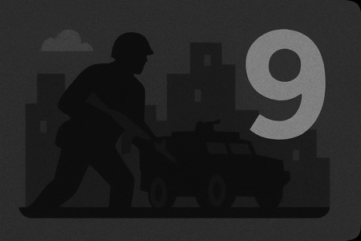

# Threat Levels

---

Below is our system World of Darkness games can use to heighten tension within their games and use for themselves as an indicator of the threat of major hunter organizations coming to their city. It is also suitable for crossover games that respect the *Silence of the Blood* and the *Veil Shall Not Be Lifted* among the Garou.

The Silence Threat Level of a game generally starts at a 1. Sabbat games are never able to drop this below a 1. The chart below details what each Silence Threat Level means in relation on a **10-point scale**.

### Threat Levels Defined

**0 - Obscured:**  
The organized hunters have no presence of interest in this city. Vampires and other supernaturals are too well hidden to present any interest.  

**1 - Dormant:**  
The standard starting Threat Level of a game. No active organized hunters involvement. Heightened sense of vigilance and light monitoring.  

**2 - Aware:**  
The organized hunters are aware of the city and is considering sending monitoring groups. Still no direct involvement.  

**3 - Probing:**  
The organized hunters send scouts and informants. A few unmarked operatives begin noting supernatural movements.  

**4 - Investigating:**  
Organized hunter scouts are in the city. Supernaturals risk exposure while active.  

**5 - Engaged:**  
Organized hunters operate openly. Teams are working on offensives.  

**6 - Aggressive Measures:**  
Coordinated strikes begin. Havens, Caerns, and safehouses are under pressure. Multiple groups mobilize under tactical leadership.  

**7 - Excommunicado:**  
The city is marked high-risk. Hostile action is frequent. Hunter groups are working in concert against larger threats.  

**8 - Siege:**  
Hunters working with the government have established control across areas. Curfews, checkpoints, and surveillance become the norm. Government and non-governmental forces coordinate at the startegic and tactical levels.  

**9 - Martial Presence:**  
The city is functionally occupied. No supernatural being may safely move. Total saturation and operational dominance.  

**10 - Anathema:**  
The city is under final judgment. All supernaturals are targeted for destruction. Hunters enact scorched-earth protocols. Only miracles, mass exodus, or total destruction can save the city.  

### Threat Level Modifiers (Monthly)

**+1** Mass Murder of Mortals (30+ in one month)  
**+1** Witnessed supernatural powers or feeding with no cover-up  
**+1** General breach of the *Silence* or *Veil* left unresolved  

**-1** Coordinated Media 5, Police 5, or Street 5 efforts over 3 months to reduce threat (per instance)  
**-1** Calculated murder of key mortal witnesses  
**-1** Controlled use of supernatural powers to erase memory in critical witnesses  

The Silence Threat Level should be calculated once per month and shared with players. If a game reaches level 10, it cannot be reduced. Storytellers are encouraged to add custom modifiers based on in-game events and player actions that reflect the unique politics and supernatural landscape of their setting.
